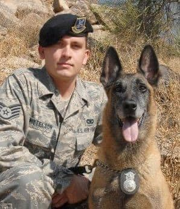

## About Phillip

{: style="float: left; padding-right: 20px"} **_Phillip Kittelson_** is a security professional with 20 plus years in law enforcement, IT, and security disciplines including personnel, physical, industrial and cybersecurity. Phillip is experienced working in various roles supporting the defense and government contracting worlds, having been employeed by large, medium, and small companies including **_[Lockheed Martin](https://www.lockheedmartin.com){: .hover-underline-animation target="_blank"}_**, **_[Raytheon Technologies](https://www.rtx.com){: .hover-underline-animation target="_blank"}_**, and **_[MindPoint Group](https://www.mindpointgroup.com){: .hover-underline-animation target="_blank"}_**. Phillip has provided direct-support to government agencies including the Departments of Defense, Homeland Security, and Justice.

{: style="float: right; padding-left: 20px"}Phillip's military experience includes Air Force Security Forces, nuclear weapons security, K9 operations, Client Systems, and Cyber Defense. Phillip is a veteran of Operation Iraqi Freedom (OIF), and Operation Enduring Freedom (OEF), and has deployed to Iraq and Afghanistan, and worked with units including the 10th Mountain Division, 3rd US Army, 32nd Infantry Division, U.S. Forces-Iraq, and U.S. Forces-Afghanistan. Phillip currently serves as a Master Sergeant in the Air Force Reserve's Cyber Defense speciality. Additionally, Phillip has been a CISSP exam reviewer.

Phillip has has degrees in criminal justice, information technology, and digital forensics. Phillip's certificaitons include Certified Information System Security Professional (CISSP) and AWS Cloud Practitioner.

For more information about Phillip's background, check out his **_[resume](./resume.html){: .hover-underline-animation}_**.

<i class="fa-solid fa-backward" style="padding-right: 0.3em;margin-left: -0.9em;color: #8B0000;"></i>[Back...](./){: .hover-underline-animation}