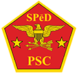

## About Phillip

{: .image-left} **_Phillip Kittelson_** is a security professional with 20 plus years in law enforcement, IT, and security disciplines including personnel, physical, industrial and cybersecurity. Phillip is experienced working in various roles supporting the defense and government contracting worlds, having been employeed by large, medium, and small companies including _Lockheed Martin_, _Raytheon Technologies_, and _MindPoit Group_. Phillip has provided direct-support to government agencies including the Departments of Defense, Homeland Security, and Justice.

Phillip's military experience includes Air Force Security Forces, nuclear weapons security, K9 operations, Client Systems, and Cyber Defense. Phillip is a veteran of Operation Iraqi Freedom, and Operation Enduring Freedom, and has deployed to countries in the Middle East, including Iraq and Afghanistan. Phillip currently serves as a Master Sergeant in the Air Force's Cyber Defense speciality.

Phillip has a bachelor's degree in Computer Forensics and Digital Investigation from _Champlain College_, and holds certifications including **[CompTIA Security+](https://www.credly.com/badges/d9894d81-0c04-4985-8f9e-f1832a965872){:target="_blank"}**, **[AWS Cloud Practitioner](https://www.credly.com/badges/05a58aaa-9fdb-4e15-9d4c-7a924816fbd3){:target="_blank"}**, and **[Certified Information System Security Professional (CISSP)](https://www.credly.com/badges/1d3668c9-52c6-424d-91b0-95e17780fe26){:target="_blank"}** from _(ISC)2_. Phillip’s prior certifications include the **[Physical Security Certification (PSC)](https://www.cdse.edu/Certification/About-SP%C4%93D-Certification/Physical-Security-Certification/){:target="_blank"}** from the _Defense Counterinteligence and Security Agency (DCSA)_.

{:height="75px" width="75px"}
{:height="75px" width="75px"}
{:height="75px" width="75px"}
{:height="75px" width="75px"}

### [Back...](./)
