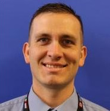

{: .center-image style="border-radius: 50%;"}

# Phillip Kittelson

<i class="fa fa-graduation-cap" aria-hidden="true" style="color:#191970"></i> Education

{: style="width: 15px; height: 15px;"} BS, Computer Forensics and Digital Investigation, Champlain College, Burlington, VT 
{: style="width: 15px; height: 15px;"} AAS Criminal Justice, Community College of the Air Force 
{: style="width: 15px; height: 15px;"} AAS Information Technology, Community College of the Air Force 

<i class="fa fa-certificate" aria-hidden="true" style="color:#191970"></i> Certifications

{: style="width: 15px; height: 15px;"} Certified Information Systems Security Professional (CISSP) (ISC)2 
{: style="width: 15px; height: 15px;"} CompTIA Security+ 
{: style="width: 15px; height: 15px;"} AWS Cloud Practitioner 

<i class="fa fa-terminal" style="color:#191970" aria-hidden="true"></i> Projects

<i class="fa fa-briefcase" aria-hidden="true" style="color:#191970"></i> Experience

{: style="width: 15px; height: 15px;"} Senior Counsultant, MindPoint Group 
{: style="width: 15px; height: 15px;"} Sr. Cyber Threat Ops Technologist II, Raytheon Technologies 
{: style="width: 15px; height: 15px;"} Sr. Cyber Defense Technologist I, Raytheon Technologies 

{: style="width: 15px; height: 15px;"} Client Systems Technician, Mid, Telos Corp. 

{: style="width: 15px; height: 15px;"} Technical Support, Lockheed Martin 
{: style="width: 15px; height: 15px;"} Security Assistant Senior, Lockheed Martin 

<i class="fa fa-star" aria-hidden="true" style="color:#191970"></i> Military Experience 

{: style="width: 15px; height: 15px;"} United States Air Force 
- Security Forces

{: style="width: 15px; height: 15px;"} USAF Reserve 
- 1D7, Cyber Defense
- 3D, Client Systems
- 3P, Security Forces