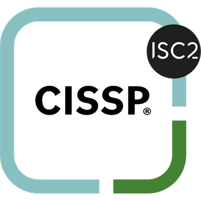

{: .center-image style="width: 250px; height: 200px;border-radius: 50%;"}

# Phillip Kittelson

<i class="fa fa-graduation-cap" aria-hidden="true" style="color:#191970"></i> Education

{: style="width: 15px; height: 15px;"} Champlain College 
{: style="width: 15px; height: 15px;"} Community College of the Air Force 

<i class="fa fa-certificate" aria-hidden="true" style="color:#191970"></i> Certifications

{: style="width: 15px; height: 15px;"} Certified Information Systems Security Professional (CISSP) (ISC)2 
{: style="width: 15px; height: 15px;"} CompTIA Security+ 
{: style="width: 15px; height: 15px;"} AWS Cloud Practitioner 

<i class="fa fa-terminal" style="color:#191970" aria-hidden="true"></i> Projects

<i class="fa fa-briefcase" aria-hidden="true" style="color:#191970"></i> Experience

{: style="width: 15px; height: 15px;"} MindPoint Group 
Senior Counsultant
{: style="width: 15px; height: 15px;"} Raytheon Technologies 
Sr. Cyber Threat Ops Technologist II
{: style="width: 15px; height: 15px;"} Raytheon Technologies 
Sr. Cyber Defense Technologist I
{: style="width: 15px; height: 15px;"} Telos Corp. 
Client Systems Technician, Md
{: style="width: 15px; height: 15px;"} Lockheed Martin 
Technical Support
{: style="width: 15px; height: 15px;"} Lockheed Martin 
Security Assistant Senior
{: style="width: 15px; height: 15px;"} United States Air Force 
3P, Security Forces
{: style="width: 15px; height: 15px;"} USAF Reserve 
1D7, Cyber Defense
3D, Client Systems
3P, Security Forces